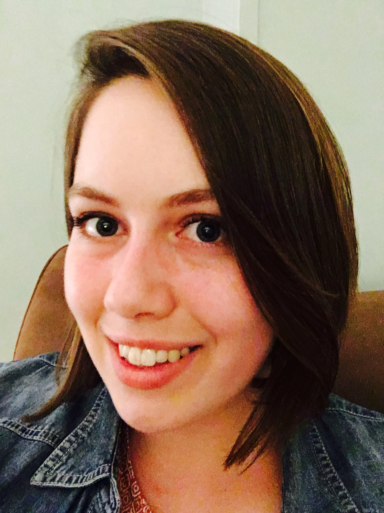

# Public Health, Data Science, Biostatistics

I am a PhD candidate in Biostatistics at the [Johns Hopkins Bloomberg School of Public Health](https://www.jhsph.edu) and expect to defend my dissertation in December 2021 or January 2022.

As an undergraduate at [St. Olaf College](https://wp.stolaf.edu/mscs/), I studied Math, Statistics, and Environmental Studies. 

## Public Health (Under Construction)

Check back soon!

## Data Science (Under Construction)

making a practice change here...

Check out some interactive plots I made here [here](Interactive_Plots/FullSphere_ChangePoint.html).

## Biostatistics

I was introduced to the world of correlated data very early on. 
As an undergraduate at Saint Olaf College, I got to be a part of an innovative course designed by 
[Paul Roback and Julie Legler](https://bookdown.org/roback/bookdown-BeyondMLR/).

For three years during graduate school, I worked with Elizabeth Colantuoni and Scott Zeger as TA for the JHSPH combined series of Longitudinal Data Analysis and Multilevel Models. 
As a part of my dissertation research, I am working with Dr. Colantuoni on developing new functions within [`frailtypack`](https://cran.r-project.org/web/packages/frailtypack/index.html) for the joint modelling of multiple recurrent event and survival outcomes.
We think these kinds of models will be important for clinical trials conducted within Intensive Care Units (ICUs).

## My life

I grew up in Webster Groves, Missouri. I love crafts, my pets, and playing games.

